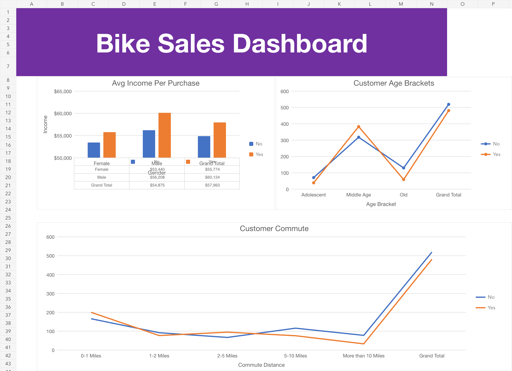

# Bike Sales Excel Dashboard

An interactive Microsoft Excel report that turns raw customer records into a clean, filterable view of bike-purchasing patterns. The project demonstrates a practical workflow for **data-quality checking, data preparation and repeatable business reporting**.

## Project result

The workbook converts **1,026 raw rows into 1,000 unique, complete records** and presents the cleaned data through three PivotTables, three PivotCharts and interactive slicers.

| Quality check | Result |
|---|---:|
| Raw records reviewed | 1,026 |
| Exact duplicate records identified and removed | 26 |
| Cleaned records retained | 1,000 |
| Duplicate IDs remaining | 0 |
| Blank fields remaining | 0 |

## Business questions

The dashboard supports quick investigation of questions such as:

- How does average income differ between customers who did and did not purchase a bike?
- Which age group contains the most bike purchasers?
- How does purchase rate vary by commute distance?
- How do marital status, education and region change the patterns shown in the report?

## Data preparation and quality checks

1. Preserved the original data on the `bike_buyers` worksheet and performed cleaning on a separate `Working Sheet`.
2. Checked for duplicate records and removed 26 exact duplicates.
3. Expanded abbreviated marital-status and gender values into consistent, readable categories.
4. Checked the cleaned dataset for duplicate IDs and blank fields.
5. Applied consistent income formatting.
6. Created age bands with nested IF statements:
   - `Adolescent`: under 31
   - `Middle Age`: 31–54
   - `Old`: 55 and above
7. Compared the final record count and key categories with the source before building the report.

This leaves a clean reporting dataset containing **1,000 unique customer IDs and no blank fields**.

## Dashboard and reporting features

- Average income by gender and bike-purchase status
- Bike purchases by age bracket
- Bike purchases by commute distance
- Interactive slicers for marital status, region and education
- Separate worksheets for raw data, working data, PivotTables and the final dashboard

The slicers update all three dashboard charts together, allowing users to answer common demographic questions without editing formulas or the underlying data.

## Descriptive findings

- Customers who purchased a bike had a higher average income (£57,963) than customers who did not (£54,875).
- Middle-aged customers recorded 383 purchases from 701 records, the largest number and highest age-group purchase rate (54.6%).
- The 2–5 mile commute group had the highest purchase rate (58.6%); the more-than-10-mile group had the lowest (29.7%).
- Filters show that the patterns change across marital status, education and region.

These are descriptive patterns within this dataset and should not be interpreted as proof that any single characteristic causes a purchase.

## Repository files

| File | Purpose |
|---|---|
| [`dashboard.xlsx`](dashboard.xlsx) | Complete workbook containing the raw data, cleaned working sheet, PivotTables and interactive dashboard |
| [`Dataset/raw_dataset.xlsx`](Dataset/raw_dataset.xlsx) | Original 1,026-row source dataset |
| [`Dataset/clean_dataset.xlsx`](Dataset/clean_dataset.xlsx) | Cleaned 1,000-row reporting dataset with the calculated age bands |

## How to explore the report

1. Download and open [`dashboard.xlsx`](dashboard.xlsx) in Microsoft Excel.
2. Select the `Dashboard` worksheet.
3. Use the marital-status, region and education slicers to filter all charts.
4. Review the `Working Sheet` and `Pivot Table` worksheets to trace each output back to the cleaned records.

## Skills demonstrated

`Excel` · `Data Cleaning` · `Duplicate Checking` · `Data Validation` · `Nested IF Statements` · `PivotTables` · `PivotCharts` · `Interactive Slicers` · `Dashboard Reporting` · `Insight Communication`
